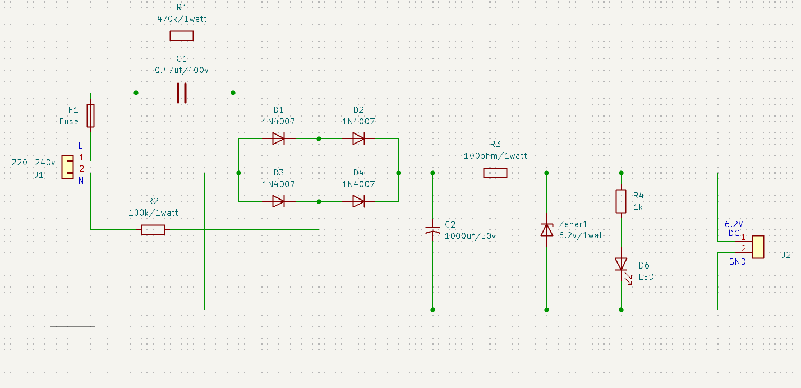
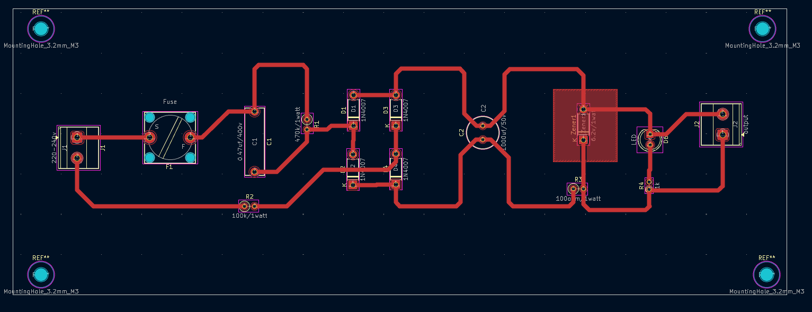

# AC to DC Capacitive Power Supply Board

## Overview
This project is a non-isolated AC to DC power supply using a capacitive dropper method.

## Features
- Input: 220–240V AC
- Bridge rectifier (1N4007 diodes)
- Capacitive dropper (0.47uF / 400V)
- Zener diode regulation (~6.2V output)
- Protection:
  - Fuse
  - Bleeder resistor

## Design Considerations
- Used capacitor dropper to reduce size and cost
- Included bleeder resistor for safety (discharging capacitor)
- Zener diode used for voltage regulation

## Challenges
- Handling high-voltage safely
- Maintaining proper spacing between components
- Managing heat dissipation

## Learnings
- AC to DC conversion using passive components  
- Importance of safety in high-voltage design  
- Role of protection components like fuse and bleeder resistor  
- PCB spacing considerations for high voltage circuits  

## Images

### Schematic

### PCB Layout

