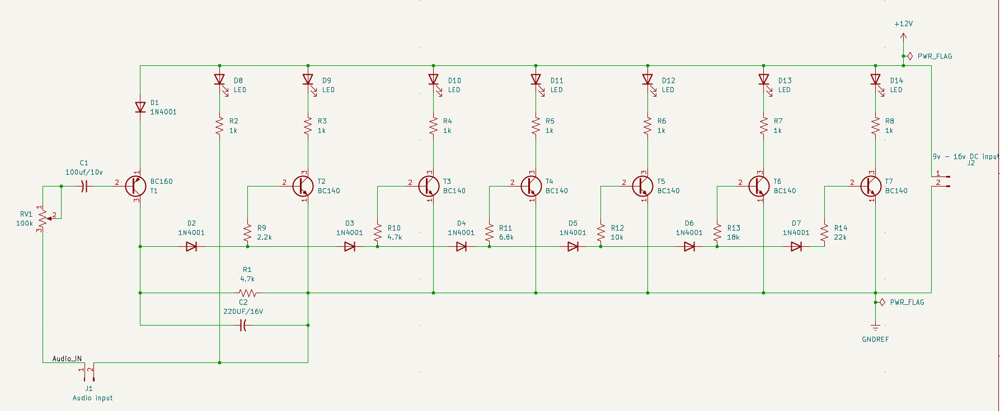
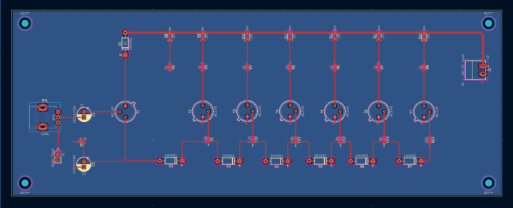
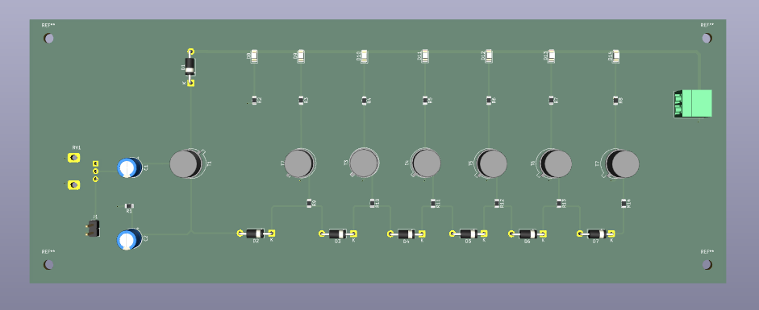
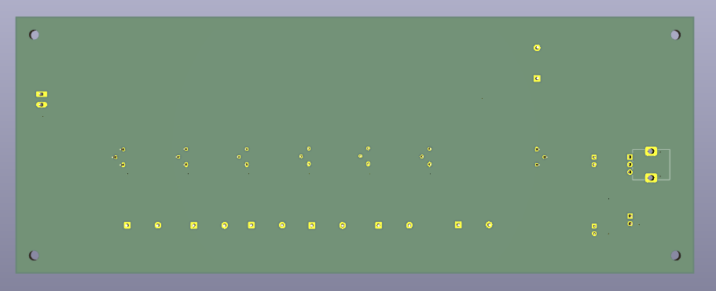

# Sound Level Indicator

## Overview
This project is a transistor-based Sound Level Indicator (Dancing Light) circuit designed to visualize audio signal intensity using multiple LEDs.  
The circuit amplifies an incoming audio signal and progressively turns ON LEDs based on the signal amplitude.

It was recreated from a college mini-project and redesigned in KiCad to verify the schematic, PCB layout, and overall working principle.

## Features
- Audio-reactive LED display
- Adjustable sensitivity using potentiometer (VR1)
- Multi-stage transistor switching
- Progressive LED indication based on sound level
- Works with 9V–16V DC supply
- Ground pour added for improved grounding and noise reduction
- Power input protection using diode
- Compact single-layer PCB design

## Circuit Operation
- Transistor T1 amplifies the incoming audio signal from the audio input.
- VR1 (100k potentiometer) controls input sensitivity.
- Capacitor C1 couples the audio signal to the transistor amplifier stage.
- Diode D1 provides reverse polarity protection.
- Capacitor C2 adds delay/smoothing for stable LED transitions.
- Diodes D2–D7 create stepped voltage levels.
- Transistors T2–T7 progressively switch ON LEDs according to audio level.

## Components Used

### Resistors
- R1, R10 – 4.7k
- R2–R8 – 1k
- R9 – 2.2k
- R11 – 6.8k
- R12 – 10k
- R13 – 18k
- R14 – 22k
- VR1 – 100k Potentiometer

### Capacitors
- C1 – 100uF / 10V
- C2 – 220uF / 16V

### Semiconductors
- T1 – BC160
- T2–T7 – BC140
- D1–D7 – 1N4001
- D8–D14 – LEDs

## PCB Design Details
- Entire bottom layer designed as a GND copper pour
- Added vias to all ground-connected pins for improved grounding
- Standard signal track width: 0.5mm
- Power line (+12V) track width: 1mm
- Connector added for audio input
- Connector added for 9V–16V DC input

## Design Considerations
- Maintained proper spacing between transistor stages
- Used wider power traces for better current handling
- Added grounding improvements to reduce noise
- Organized components for easier routing and assembly
- Included mounting holes for PCB stability

## Challenges
- Recreating an old hand-drawn schematic accurately
- Resolving ERC and connectivity issues in KiCad
- Managing routing for multiple transistor stages
- Improving grounding for stable LED response

## Learnings
- Multi-stage transistor switching concepts
- Audio signal amplification basics
- Importance of grounding and copper pours in PCB design
- PCB routing and trace width optimization
- ERC/DRC debugging in KiCad

## Project Files
- KiCad Schematic
- KiCad PCB Layout
- KiCad Project Files
- PCB Render Images
  
## Images

### Schematic

### PCB Layout

### 3D Front View

### 3D Back View

## Future Improvements
- Add LM3915/LM358 based version for improved performance
- Add microphone input stage
- Add adjustable LED response speed
- Design double-layer compact version
  
## 📌 Note
This project was recreated as part of my PCB design and embedded systems learning journey to practice schematic capture, PCB layout, grounding techniques, and hardware debugging.
