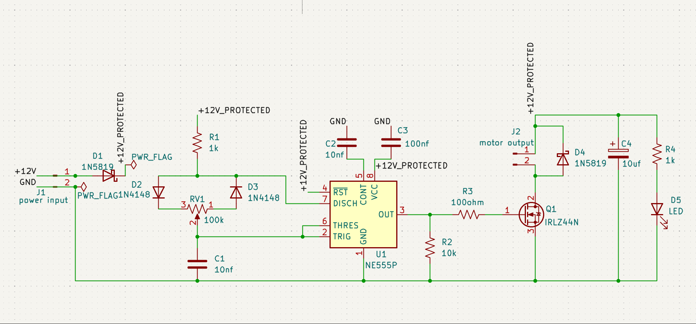
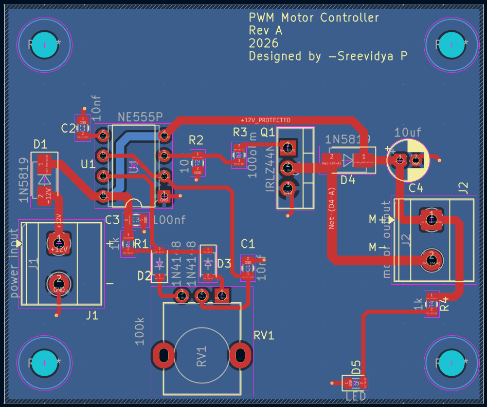
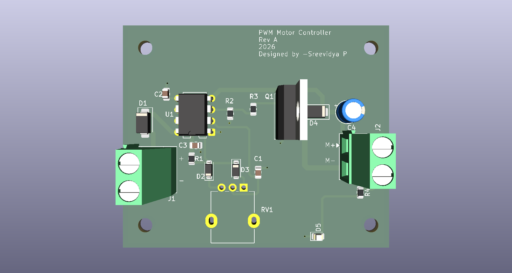
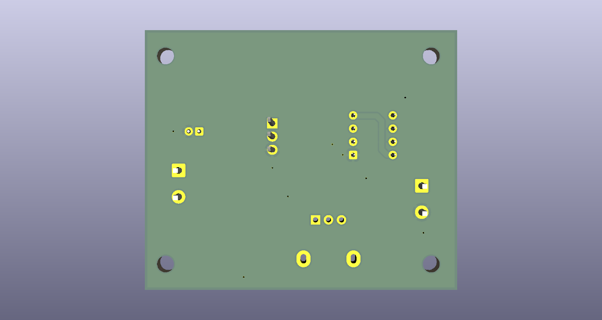

# PWM Motor Controller

## Overview

This project implements a **PWM (Pulse Width Modulation) Motor Controller** using the **NE555 timer IC** to control the speed of a 12 V DC motor. The PWM duty cycle is adjusted using a potentiometer, allowing smooth motor speed variation while maintaining efficient power delivery through a logic-level MOSFET.

The project was designed to strengthen my understanding of timer-based PWM generation, MOSFET switching circuits, and PCB layout techniques for mixed-signal and power electronics applications.

---

## Features

- NE555-based PWM signal generation
- Adjustable duty cycle using a 100 kΩ potentiometer
- IRLZ44N logic-level MOSFET for efficient motor switching
- Reverse polarity protection at the power input
- Flyback diode protection for inductive loads
- Gate resistor and pull-down resistor for reliable MOSFET operation
- Decoupling capacitors for stable timer performance
- Compact PCB layout with mounting holes
- ERC and DRC verified design

---

## Design Considerations

- Configured the NE555 timer in astable mode to generate a variable PWM signal.
- Used steering diodes around the potentiometer to independently control the charging and discharging paths of the timing capacitor, enabling smooth PWM duty-cycle adjustment.
- Selected the IRLZ44N logic-level MOSFET to ensure reliable switching directly from the NE555 output.
- Added reverse polarity protection at the power input to safeguard the circuit against incorrect supply connections.
- Included a flyback diode across the motor output to suppress inductive voltage spikes generated during switching.
- Placed decoupling capacitors close to the NE555 supply pins to improve switching stability and reduce electrical noise.
- Used wider PCB traces for the motor power path to support higher current flow and minimize voltage drop.
- Arranged components to achieve a compact layout while maintaining clear separation between the control and power sections.

---

## Learnings

- Developed a practical understanding of PWM generation using the NE555 timer.
- Learned how steering diodes can independently control capacitor charging and discharging to vary PWM duty cycle.
- Improved my understanding of MOSFET gate drive requirements and switching circuit design.
- Gained hands-on experience designing PCB layouts for mixed-signal and power electronics circuits.
- Practiced implementing reverse polarity and flyback protection for improved circuit reliability.
- Strengthened my PCB layout workflow through component placement, power routing, ground plane implementation, and ERC/DRC verification.

---

## Images

### Schematic

<p align="center">
  
</p>

### PCB Layout

<p align="center">
  
</p>

### 3D View (Front)

<p align="center">
  
</p>

### 3D View (Back)

<p align="center">
  
</p>

---

## Project Files

```
